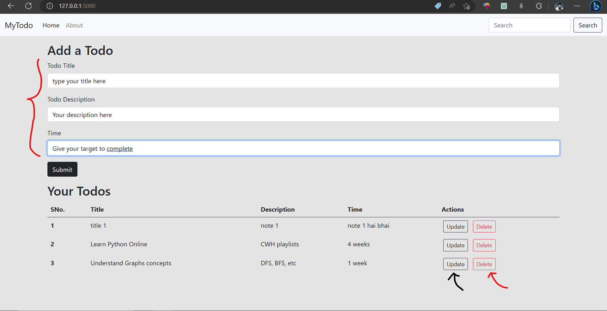
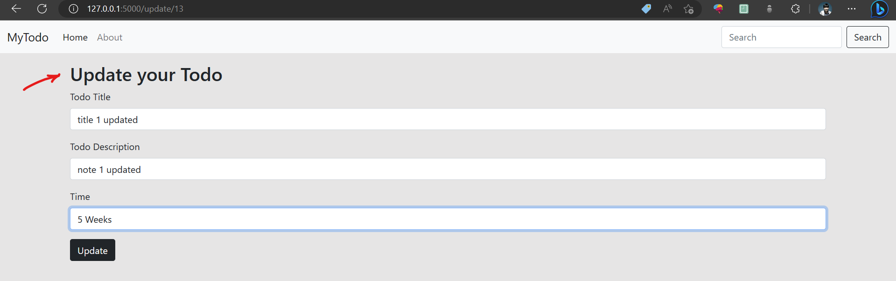
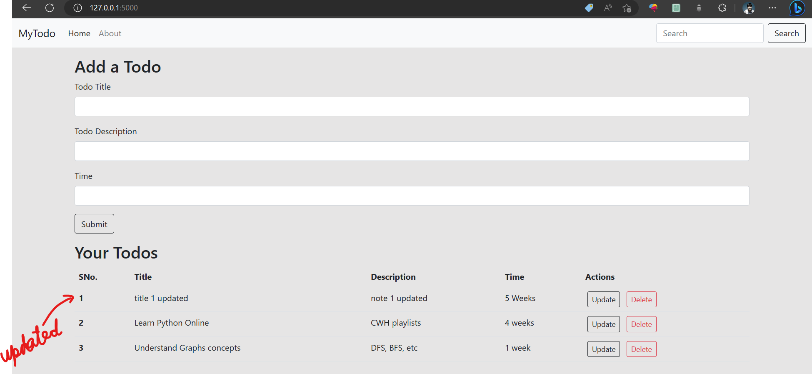
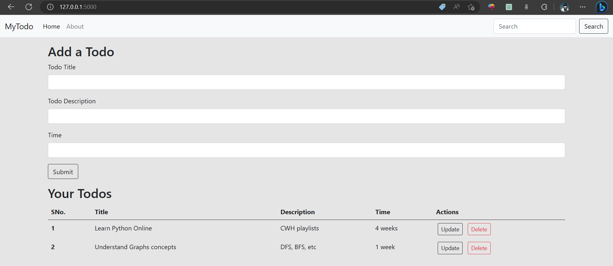

## TodoList Flask App📚 | First Flask Project
- Todolist app performs the CRUD operations like CREATE(to create your todos), READ(to display todo lists), similarly UPDATE and DELETE to delete your todo list from database.
- WebApp is built using flask(python framework)

## UI of the todolist 
 [READ + CREATE]

 [UPDATE]

 [AFTER UPDATE]    
 [DELETE]

#### ~ Any suggestions for improvements are welcome :)